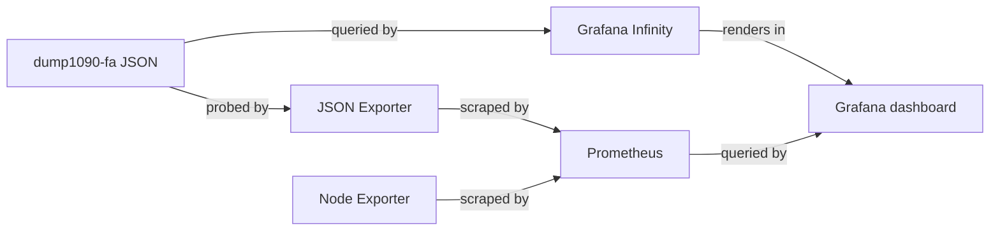

# Architecture

This project connects its data source to its Grafana dashboard through the components shown below.

## Overview

This diagram shows the data path for this project.



## Components

### Data source

dump1090-fa JSON -> JSON Exporter -> Prometheus -> Grafana; Infinity reads aircraft JSON for the map.

### Dashboard

`dashboards/adsb-aircraft-viewer.json` contains the Grafana dashboard definition.

## Data flow

dump1090-fa JSON -> JSON Exporter -> Prometheus -> Grafana; Infinity reads aircraft JSON for the map. Grafana evaluates dashboard queries against the selected data source and label values.

## Directory layout

```text
.
├── dashboards/  Grafana dashboard JSON files
├── examples/  Scrape and deployment examples
├── docs/        Documentation source
└── README.md    Project overview and quick links
```
